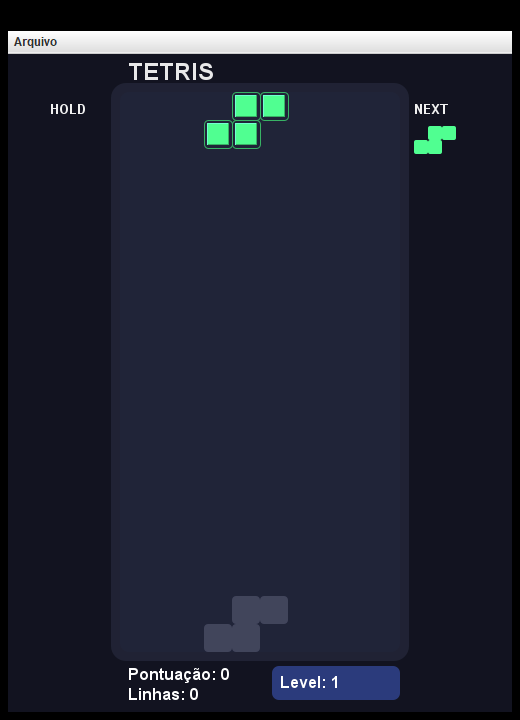

# Tetris Java PRO

Jogo de Tetris em Java com interface gráfica Swing, cinco modos de jogo e ranking salvo em PostgreSQL.

Desenvolvido como avaliação final da disciplina de **Programação Orientada a Objetos** do curso de Ciência da Computação da Unicesumar.

<p align="center">
  
</p>

## Funcionalidades

- Cinco modos de jogo (veja a tabela abaixo)
- Peça fantasma, que mostra onde a peça atual vai cair
- Hold: guarda a peça atual para usar depois (uma vez por peça)
- Prévia da próxima peça
- Níveis com velocidade crescente
- Ranking com as 10 melhores pontuações, salvo no banco de dados

### Modos de jogo

| Modo | Como termina |
|------|--------------|
| Maratona | Ao alcançar o nível 15 |
| Infinito | Somente quando o tabuleiro enche |
| Tempo | Após 3 minutos |
| Sprint | Ao eliminar 40 linhas |
| Zen | Sem objetivo; jogue até o tabuleiro encher |

Em todos os modos a partida também acaba se o tabuleiro encher.

### Pontuação e níveis

| Linhas eliminadas de uma vez | Pontos |
|------------------------------|--------|
| 1 | 100 × nível |
| 2 | 300 × nível |
| 3 | 500 × nível |
| 4 | 800 × nível |

O nível sobe a cada 10 linhas eliminadas. A peça começa caindo uma linha por segundo e fica 0,1 s mais rápida a cada nível, até o limite de 0,1 s por linha.

## Controles

| Tecla | Ação |
|-------|------|
| ← → | Mover |
| ↓ | Descer uma linha |
| ↑ | Rotacionar |
| Espaço | Queda rápida |
| Shift | Hold |
| R | Reiniciar (no fim da partida) |
| Esc | Voltar ao menu |

Para salvar a pontuação, use o menu **Arquivo → Salvar Pontuação** durante a partida. O ranking fica em **Arquivo → Ver Ranking**.

## Como executar

### Pré-requisitos

- JDK 17 ou superior
- PostgreSQL em execução, para salvar pontuação e ver o ranking. Sem o banco o jogo abre e funciona normalmente; apenas essas duas opções mostram erro.

### Passos

1. Clone o repositório:

   ```
   git clone https://github.com/KawanVictor/TetrisV2-java.git
   cd TetrisV2-java
   ```

2. Execute o jogo.

   No Windows, rode o script que compila e inicia:

   ```
   run.bat
   ```

   Em Linux ou macOS:

   ```
   mkdir -p bin
   javac -encoding UTF-8 -d bin -cp "lib/*" $(find src -name "*.java")
   java -cp "bin:lib/*" Main
   ```

   Em uma IDE (VSCode, IntelliJ, Eclipse), use `src` como pasta de fontes, adicione `lib/*.jar` ao classpath e execute a classe `Main`. No VSCode com o Extension Pack for Java isso já é o padrão.

### Banco de dados

Na primeira conexão o jogo cria sozinho o banco `tetrisdb` e as tabelas. Para criar manualmente, use o script `create_tables.sql`.

A conexão padrão é `localhost:5432`, usuário `postgres`, senha `123`. Para usar outros valores, defina as variáveis de ambiente antes de iniciar o jogo:

| Variável | Padrão |
|----------|--------|
| `TETRIS_DB_HOST` | `localhost` |
| `TETRIS_DB_PORT` | `5432` |
| `TETRIS_DB_NAME` | `tetrisdb` |
| `TETRIS_DB_USER` | `postgres` |
| `TETRIS_DB_PASSWORD` | `123` |

## Estrutura do projeto

```
src/
├── Main.java    ponto de entrada
├── domain/      regras do jogo: Partida, Tabuleiro, Tetromino, modos, pontuação
├── service/     serviços de apoio: peça fantasma, hold, entrada, ranking, log
├── infra/       acesso ao PostgreSQL (conexão e DAOs)
├── ui/          telas Swing: janela, menu e painel do jogo
└── util/        utilitários
lib/             driver JDBC do PostgreSQL
create_tables.sql
run.bat
```

Cada modo de jogo é uma subclasse de `ModoPartida` que define apenas a sua condição de término, então adicionar um modo novo não exige alterar `Partida`.

## Em desenvolvimento

O código já tem a base das funcionalidades abaixo, mas elas ainda não estão ligadas à interface:

- Multiplayer local (`MultiplayerManager`)
- Seleção de temas visuais (`TemaSelectorPanel`, `TemaService`)
- Configuração de teclas (`InputConfigPanel`)
- Histórico de partidas no banco (`PartidaDAO`)
- Log de eventos em arquivo (`LogJogo`)
- Salvar e carregar partidas

## Tecnologias

- Java 17+
- Java Swing
- PostgreSQL com JDBC

## Autor

**Kawan Victor Cavalcante** — RA 24151609-2
[github.com/KawanVictor](https://github.com/KawanVictor)

Projeto com fins acadêmicos. Sinta-se à vontade para estudar, adaptar e evoluir.
